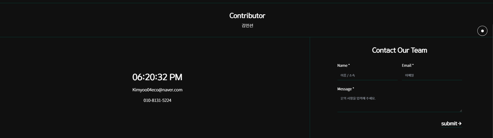
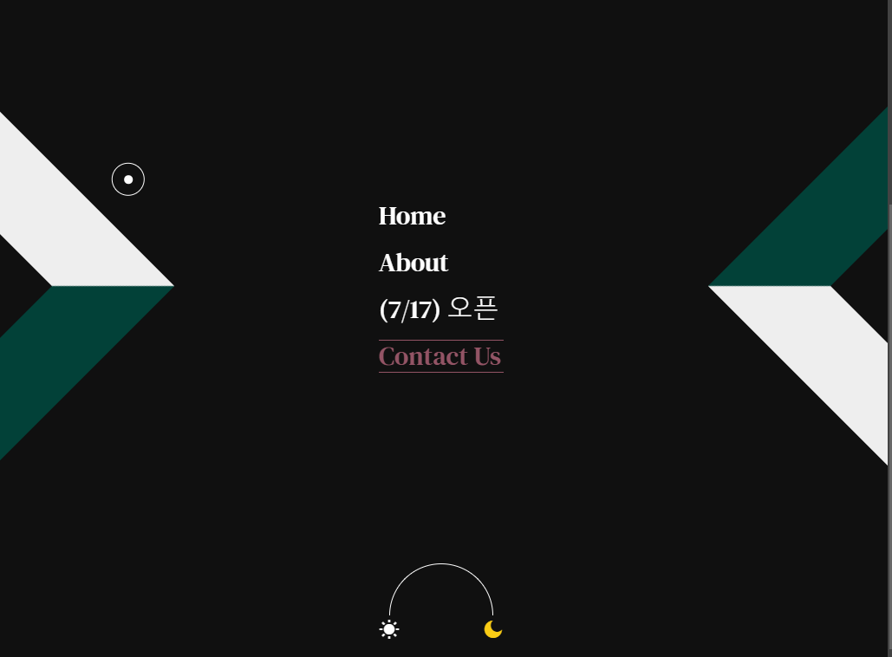
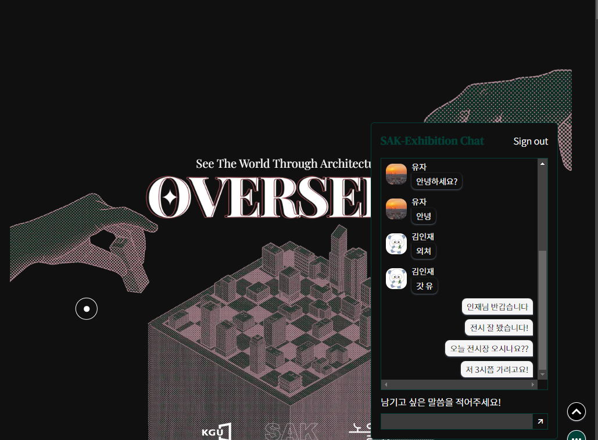

# 🏛 SAK Exhibtion Website

### 경기대학교 건축학과 온라인 졸업 전시 웹사이트

## 목차

1. [프로젝트 소개](#1-프로젝트-소개)
2. [서비스 주요 기능](#2-서비스-주요-기능)
3. [기술 스택](#3-기술-스택)
4. [프로젝트 팀원 소개](#4-프로젝트-팀원-소개)
5. [실행 방법](#5-실행-방법)

<br>

## **1. 프로젝트 소개**

### **1.1 프로젝트 개요**

**SAK-EXHIBITION**

"`SAK-Exhibition`은 경기대학교 건축학과 온라인 졸업 전시회 및 작품 아카이빙을 위해 제작된 웹사이트입니다.

물리적, 시간적 제약 없이 학생들의 작품을 전시하고, 관람할 수 있도록 함으로써

더 많은 사람들이 함께 즐길 수 있는 전시 환경을 구축하고자 합니다.


<br>

### **1.2 서비스 목표**

- 경기대학교 건축학과 재학생과 졸업생들이 온라인 공간에 졸업 작품을 전시하고 아카이빙할 수 있도록 합니다.

- 온라인 팜플렛, 검색 필터, 동적인 애니메이션 효과, 방명록 기능을 통해 관객과의 원활한 소통을 유도합니다.

<br>

## **2. 서비스 주요 기능**

### **2.1 Home (랜딩페이지)**

- 전시 포스터 및 컨셉, 스튜디오, 오프라인 전시장 위치 등 기본 정보를 제공합니다.

- 오프라인 전시장을 본뜬 3D 그래픽을 통해 온라인 관람 여정에 현장감과 재미 요소를 더합니다.

- About Exhibition: 5 개 스튜디오의 컨셉과 상세 정보를 제공합니다.

- See Exhibition: Exhibition 페이지 (온라인 전시 공간) 으로 이동합니다.


### **2.2 About (스튜디오 소개)**

- 5개 스튜디오의 컨셉을 확인할 수 있습니다.


### **2.3 Exhibition (온라인 전시회)**

- 7/17 오픈 예정

### **2.4 Contact us (팀원 소개)**

- 졸업전시 위원회와, 사이트를 제작한 Sae-sak 팀원에 대한 소개를 제공합니다.

- 개발자에게 이메일을 전송할 수 있습니다.




### **2.5 부가 기능**

- 데이 모드, 나이트 모드 설정이 가능합니다.
- 구글 계정을 통해 채팅에 참여할 수 있습니다.




<br>

## **3. 기술 스택**

      

<br>

## **4. 프로젝트 팀원 소개**

김 유 (Kim Yoo)

- :e-mail: E-mail: [kimyoo04@gmail.com](mailto:kimyoo04@gmail.com)
- :smile_cat: Github: [kimyoo04](https://github.com/kimyoo04)

정채영 (Jeong Chaeyoung)

- :e-mail: E-mail: [essentials106@ewhain.net](mailto:essentials106@ewhain.net)
- :smile_cat: Github: [chae-zero](https://github.com/chae-zero)

김민선 (Kim Minseon)

- Contributor

<br>

## **5. 실행 방법**

### 5-1. 환경변수 설정

- 프로젝트를 실행하기 전에 `.env` 파일을 설정해야 합니다.
- `.env` 파일을 프로젝트 루트 디렉토리에 생성하고 아래와 같이 키(key)를 작성하세요.

```
# Firebase
NEXT_PUBLIC_FIREBASE_APIKEY
NEXT_PUBLIC_FIREBASE_AUTHDOMAIN
NEXT_PUBLIC_FIREBASE_PROJECTID
NEXT_PUBLIC_FIREBASE_STORAGEBUCKET
NEXT_PUBLIC_FIREBASE_MESSAGINGSENDERID
NEXT_PUBLIC_FIREBASE_APPID

# Gmail SMTP
NEXT_PUBLIC_EMAIL
NEXT_PUBLIC_PASSWORD

# Site Verification
NEXT_PUBLIC_NAVER_SITE_VERIFICATION
NEXT_PUBLIC_GOOGLE_SITE_VERIFICATION

# Google Analytics
NEXT_PUBLIC_GOOGLE_ANALYTICS_KEY

# Naver API
NEXT_PUBLIC_NAVER_MAP_CLIENT_ID
```

### 5-2. 서비스 실행

- 작업 중인 디렉토리에서 아래 코드를 실행하세요.

```
npm i
npm run dev
```
